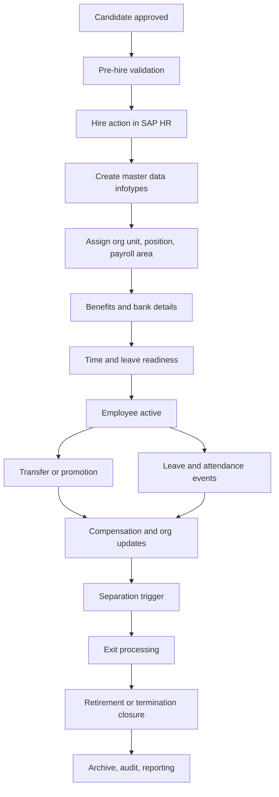

# H2R Lifecycle Overview

## Objective

Create a single reusable framework for employee lifecycle administration from hiring through retirement, reducing manual HR transactions and improving auditability.

## End-to-End Flow

## Core Process Areas

### 1. Hire

- Validate mandatory data before action start.
- Execute hiring action using personnel actions.
- Create core infotypes.
- Trigger onboarding tasks for payroll, IT, and business users.

### 2. Employee Administration

- Maintain personal, organizational, and payroll-relevant data.
- Process transfers, promotions, salary changes, and manager changes.
- Maintain reporting line integrity through OM relationships.

### 3. Time and Leave

- Register absences and attendances.
- Validate leave type, quota, and date overlaps.
- Route exceptions to HR or line manager approval.

### 4. Separation

- Capture action reason and last working day.
- Trigger offboarding checklist.
- Stop future-dated payroll and benefit participation where required.

### 5. Retirement

- Use a retirement-specific action reason.
- Finalize settlement, gratuity, pension, or statutory processes.
- Freeze employee from regular operational workflows after retirement closure.

## Key Control Points

- Duplicate employee check
- Valid position and org assignment
- Payroll area and pay scale consistency
- Leave overlap checks
- Effective-dated action sequencing
- Separation versus retirement reason governance
- Audit logging of lifecycle changes

## Example SAP Objects In Scope

- Personnel actions in `PA40`
- Master data maintenance in `PA30`
- Organizational assignment through `OM`
- Leave data via time infotypes
- Workflow notifications via custom class or workflow event linkage
