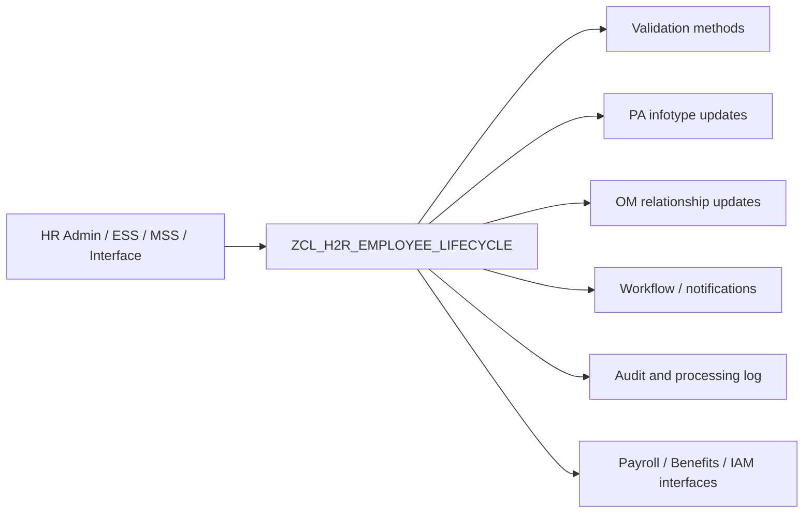

# H2R Technical Design

## Technical Goal

Implement a reusable ABAP service layer for HR lifecycle events, where each lifecycle step is controlled by a clear method and returns structured messages.

## Proposed Architecture

## Main Class Strategy

Primary class:

- `ZCL_H2R_EMPLOYEE_LIFECYCLE`

Recommended responsibilities:

- `HIRE_EMPLOYEE`
- `PROCESS_ORG_CHANGE`
- `PROCESS_LEAVE`
- `SEPARATE_EMPLOYEE`
- `RETIRE_EMPLOYEE`
- `VALIDATE_ACTION_INPUT`
- `BUILD_RETURN_MESSAGE`

## Suggested Data Model

### Input structure

- Employee number
- Action type
- Action reason
- Effective date
- Position
- Org unit
- Payroll area
- Basic pay
- Leave type and dates

### Output structure

- Processing status
- SAP message type
- SAP message text
- Infotype updated
- Next action hint

## Design Principles

- Keep reports and UI wrappers thin.
- Centralize validations inside a global class.
- Use effective-dated logic consistently.
- Build messages with `BAPIRET2`.
- Prepare methods so they can later be wrapped by RFC, OData, or workflow steps.

## Integration Points

- Payroll replication or payroll control checks
- Benefits enrollment
- Identity and access management provisioning
- Email or workflow notifications
- Audit log persistence in a custom table such as `ZHRT_H2R_AUDIT`

## Recommended Custom Objects

| Object Type | Example Name | Purpose |
|---|---|---|
| Class | `ZCL_H2R_EMPLOYEE_LIFECYCLE` | Core service logic |
| Interface | `ZIF_H2R_CONSTANTS` | Common action codes |
| Report | `ZHR_H2R_EMPLOYEE_LIFECYCLE_DEMO` | Demo wrapper for testing |
| Table | `ZHRT_H2R_AUDIT` | Audit trail |
| Message class | `ZHR_H2R` | Central messages |

## Security and Compliance

- Restrict hire, separation, and retirement actions by role.
- Protect compensation fields with stronger authorizations.
- Log who executed the lifecycle action and when.
- Separate DEV, QAS, and PRD connection aliases in VS Code.
